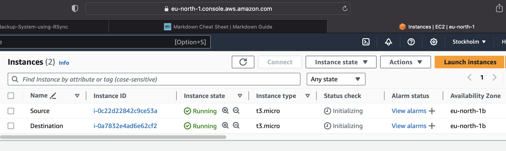
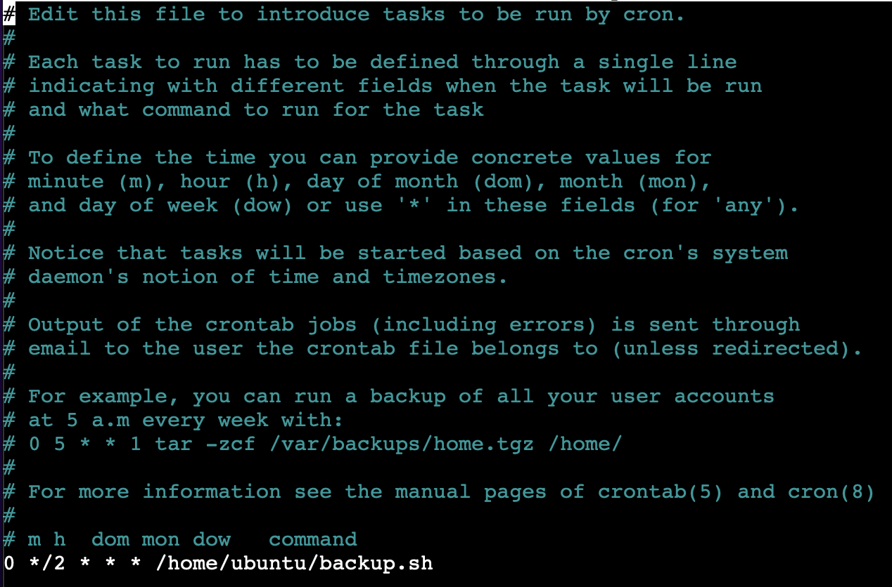

# Automated Backup System using Rsync
## Prerequisites
Below are prerequisites needed for the project:

- Two Ubuntu servers (one named Source and the other named Destination)
- SSH access to both servers
- Basic knowledge of Linux command line
​

## Step by Step Implementation

The following step by step guide is used to implement the project

### Step 1 : Setup Source and destination servers on AWS

​Setup the ubuntu servers named Source and Destination on AWS. Ensure SSH traffic is enabled on both servers.



Update the servers and install Rsync.
​
```
sudo apt update
​
sudo apt install rsync
```
​

### Step 2 : Configure SSH Key-based Authentication

We will set up SSH key-based authentication between the source and destination servers to allow secure communication without password prompts.
​

Generate an SSH key pair on the source server:
​
```
ssh-keygen -t rsa
```
​

Use ssh-copy-id to copy the public ip to the destination server 
​
```
ssh-copy-id username@target_server_ip_address
```
​
_if the above method doesn't work try copying it manually using the below command_
​
```
cat ~/.ssh/id_rsa.pub
```
​
Copy the displayed text
​

Run the command below in the destination sever
​
```
echo "your_copied_public_key_here" >> ~/.ssh/authorized_keys
```
​

Change permission of authorized_keys 
​
```
chmod 600 ~/.ssh/authorized_keys
```
Once the public key has been copied into the Destination server, try connecting to the destination server using SSH from the source server:
​
```
ssh username@target_server_ip_address
```


​Run `exit` to close the connection


### Step 3 : Create test users and user data to backup

Create test users directory

`mkdir Users`

Add test users using touch command and configuration data using nano editor


### Step 4 : Create Backup Script

Create a backup script in the source server
​
```
nano backup.sh
```
​
Copy the below into the backup.sh and modify as required
​
```
#!/bin/bash
​
set -x
set -e
​
​
# Define source and destination directories
SRC_DIR="/path/to/source"
DEST_HOST="username@destination_server_ip"
DEST_DIR="/path/to/destination"
​
# Rsync command to synchronize files and directories
rsync -avz --delete $SRC_DIR $DEST_HOST:$DEST_DIR
​
# Check rsync exit status
if [ $? -eq 0 ]; then
    echo "Backup completed successfully."
    
else
    echo "Backup failed!"
   
fi
​
```

Save the edited script and exit. 


​

Make the script executable:
​
```
chmod +x backup.sh
```
​Check backup to Destination server works by running

`./backup.sh`

Backup to the Destination server can also be carried out using the rsync command
```
rsync -a ~/source_directory username@remote_host:destination_directory
```


If successful, Destination backup directory will now contain the test Users directory and config data from the Source server


### Step 5 : Schedule Backup with Cron

Edit the crontab file to schedule regular backups:
​
```
crontab -e
```
Add a cron job to execute the backup script at the desired interval. for every 2hours:
​
```
0 */2 * * * /path/to/backup.sh
```
